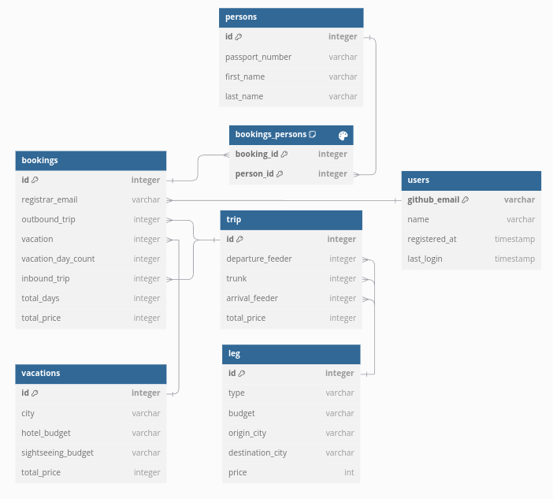

# 🌍 backend.travel.intercogni.com

## 👥 Collaborators

- **Name:** Taib Izzat Samawi
   - **NRP:** 5025221085
   - **Class:** IUP

- **Name:** Franshel Traneta
   - **ID:** ----
   - **Class:** IUP

`backend.travel.intercogni.com` is the backend implementation of a travel booking system that allows users to create, retrieve, and delete complex travel bookings. It includes functionalities for managing trips, vacations, and associated people.

## 📑 Table of Contents

- [🌍 backend.travel.intercogni.com](#-backendtravelintercognicom)
  - [👥 Collaborators](#-collaborators)
  - [📑 Table of Contents](#-table-of-contents)
  - [🗂️ Database Diagram](#️-database-diagram)
  - [🛠️ Installation](#️-installation)
  - [🚀 Usage](#-usage)
  - [📡 API Endpoints](#-api-endpoints)
    - [Create Complex Booking](#create-complex-booking)
    - [Get Complex Booking](#get-complex-booking)
    - [Delete Booking](#delete-booking)
    - [Get All Bookings](#get-all-bookings)
    - [Update General Info](#update-general-info)
  - [🗄️ Database Schema](#️-database-schema)
  - [🗂️ Project Structure](#️-project-structure)
  - [📦 Dependencies](#-dependencies)

## 🗂️ Database Diagram


## 🛠️ Installation

1. Clone the repository:
   ```sh
   git clone https://github.com/yourusername/travel-booking-system.git
   cd travel-booking-system
   ```

2. Install dependencies:
   ```sh
   go mod tidy
   ```

3. Run the application:
   ```sh
   go run main.go
   ```

## 🚀 Usage

The application runs a web server on `http://localhost:8080`. You can interact with the API using tools like `curl` or Postman.

## 📡 API Endpoints

### Create Complex Booking

- **URL:** `/api/bookings/create-complex`
- **Method:** `POST`
- **Request Body:**
   ```json
   {
      "registrar_email": "user@example.com",
      "outbound_trip": {
         "departure_feeder": {
            "type": "bus",
            "budget": "economy",
            "origin_city": "New York",
            "destination_city": "Boston",
            "price": 100
         },
         "trunk": {
            "type": "airplane",
            "budget": "economy",
            "origin_city": "Boston",
            "destination_city": "Amsterdam",
            "price": 2000
         },
         "arrival_feeder": {
            "type": "bus",
            "budget": "economy",
            "origin_city": "Amsterdam",
            "destination_city": "Den Haag",
            "price": 100
         },
         "total_price": 2200
      },
      "vacation": {
         "city": "Amsterdam",
         "hotel_budget": "luxury",
         "sightseeing_budget": "standard",
         "total_price": 3000
      },
      "vacation_day_count": 7,
      "inbound_trip": {
         "departure_feeder": {
            "type": "bus",
            "budget": "economy",
            "origin_city": "Den Haag",
            "destination_city": "Amsterdam",
            "price": 100
         },
         "trunk": {
            "type": "airplane",
            "budget": "economy",
            "origin_city": "Amsterdam",
            "destination_city": "Boston",
            "price": 2000
         },
         "arrival_feeder": {
            "type": "bus",
            "budget": "economy",
            "origin_city": "Boston",
            "destination_city": "New York",
            "price": 100
         },
         "total_price": 2200
      },
      "total_days": 14,
      "total_price": 7400,
      "price_per_pax": 3700,
      "start_date": "2023-01-01",
      "end_date": "2023-01-15",
      "origin": "New York",
      "destination": "Amsterdam",
      "persons": [
         {
            "nationality": "american",
            "passport_number": "1234567890",
            "first_name": "John",
            "last_name": "Doe"
         }
      ]
   }
   ```

### Get Complex Booking

- **URL:** `/api/bookings/get-complex`
- **Method:** `POST`
- **Request Body:**
   ```json
   {
      "booking_id": 1
   }
   ```

### Delete Booking

- **URL:** `/api/bookings/delete`
- **Method:** `POST`
- **Request Body:**
   ```json
   {
      "booking_id": 1
   }
   ```

### Get All Bookings

- **URL:** `/api/bookings/get-all`
- **Method:** `POST`
- **Request Body:**
   ```json
   {
      "email": "user@example.com"
   }
   ```

### Update General Info

- **URL:** `/api/set-general-info`
- **Method:** `POST`
- **Request Body:**
   ```json
   {
      "origin_city": {
         "name": "New York",
         "lat": 40.7128,
         "long": -74.0060
      },
      "origin_airport_city": {
         "name": "John F. Kennedy International Airport",
         "description": "JFK Airport",
         "lat": 40.6413,
         "long": -73.7781,
         "iata_code": "JFK"
      },
      "destination_airport_city": {
         "name": "Amsterdam Airport Schiphol",
         "description": "Schiphol Airport",
         "lat": 52.3105,
         "long": 4.7683,
         "iata_code": "AMS"
      },
      "destination_city": {
         "name": "Amsterdam",
         "lat": 52.3676,
         "long": 4.9041
      }
   }
   ```

## 🗄️ Database Schema

The database schema is defined in `db_setup.sql` and includes the following tables:

- `users`
- `bookings`
- `bookings_people`
- `people`
- `vacations`
- `trips`
- `legs`

## 🗂️ Project Structure

```
.gitignore
airport_data.csv
booking_example_2.json
booking_example_3.json
booking_example.json
database.sqlite
db_setup.sql
email_example.json
filter.py
general_info_example.json
go.mod
go.sum
large_airports.csv
main.go
packages/
   cities/
      cities.go
```

## 📦 Dependencies

- [github.com/gin-gonic/gin](https://github.com/gin-gonic/gin)
- [github.com/jmoiron/sqlx](https://github.com/jmoiron/sqlx)
- [github.com/mattn/go-sqlite3](https://github.com/mattn/go-sqlite3)
- [gorm.io/driver/sqlite](https://gorm.io/driver/sqlite)
- [gorm.io/gorm](https://gorm.io/gorm)
- [github.com/rs/cors](https://github.com/rs/cors)

For a complete list of dependencies, refer to the `go.mod` and `go.sum` files.